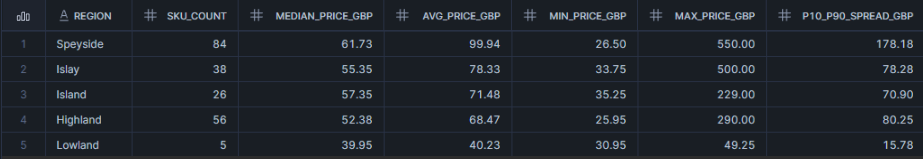
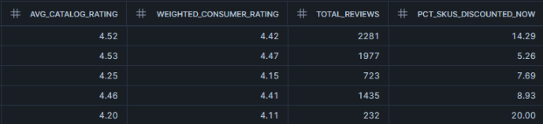
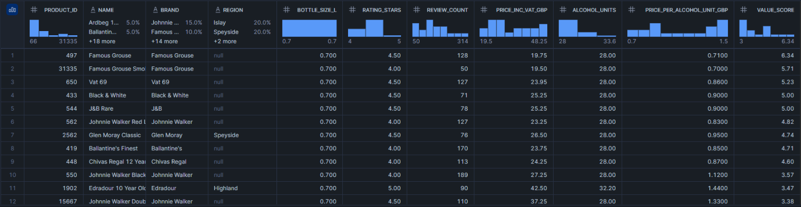
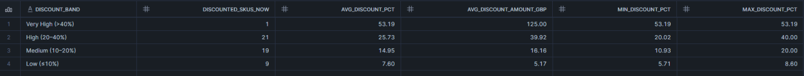
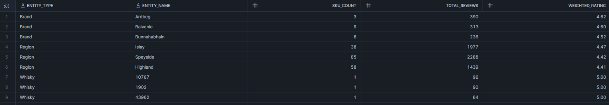
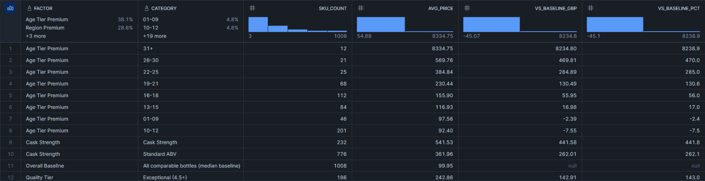
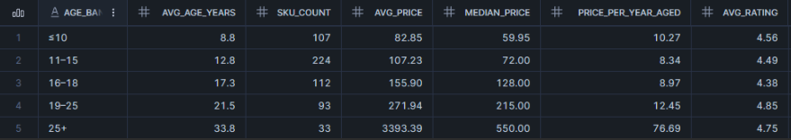
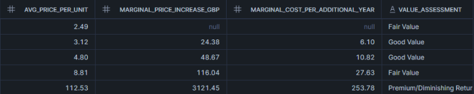

# Analytics Queries Documentation

This document describes the analytical SQL queries used in the project, outlining  
the business questions addressed, data sources, and key insights derived from each analysis.

Each query is implemented in `analytics_queries.sql` and supported by visual outputs  
stored in the `outputs/screenshots/` directory.

---

### Q1. Brand-Level Price & Quality Positioning

**Business Question**  
How do brands differ in terms of pricing, product spread, customer ratings, and current promotional activity?

**Query Reference**  
`analytics_queries.sql` → Query 1 (Brand-Level Price and Quality Positioning)

**Source View**  
`VW_PRODUCT_LATEST`

**Analytical Interpretation**  
- Macallan and Balvenie emerge as the strongest premium brands, combining the highest median prices with consistently high weighted consumer ratings (≈4.4–4.6), indicating strong brand equity and customer trust at higher price points.
- Glenfiddich and Johnnie Walker show the widest price spreads, suggesting broad portfolios that span both entry-level and premium offerings rather than a single pricing tier.
- Brands such as Aberlour, Glenfarclas, and Bunnahabhain achieve high consumer ratings while maintaining mid-range pricing, indicating strong value-for-money positioning.
- Discount activity is uneven across brands: some premium brands maintain a near zero on-sale rate, reinforcing exclusivity, while others (e.g., Johnnie Walker, Balvenie) use selective promotions to drive volume.
- Overall, higher pricing does not correlate negatively with customer ratings, suggesting that perceived quality and brand reputation outweigh price sensitivity in this category.

**Suggested Screenshot**  

---

### Q2. Region-Level Pricing, Quality & Promotion (Single Malt)

**Business Question**  
Which whisky regions are priced higher, which regions deliver the strongest customer ratings, and where are promotions most common (within comparable Single Malt bottles)?

**Query Reference**  
`analytics_queries.sql` → Query 2 (Region-Level Pricing, Quality, and Promotion)

**Source View**  
`VW_PRODUCT_LATEST`

**Analytical Interpretation**  
- **Speyside** dominates the category with the largest SKU count and the highest average pricing, indicating both scale and strong premium positioning.
- **Islay** achieves the strongest weighted consumer ratings, suggesting particularly high perceived quality and brand loyalty despite premium pricing.
- **Highland** balances scale and value, offering a large number of SKUs at slightly lower prices while maintaining strong customer satisfaction.
- **Lowland**, with the smallest SKU base, shows the highest discount intensity, likely reflecting weaker pricing power or inventory-clearing strategies.
- Overall, regional identity plays a clear role in both pricing and consumer perception, with premium regions sustaining higher prices without sacrificing ratings.

**Suggested Screenshot**

---

### Q3. Best Value-for-Money Whiskies (Top 20)

**Business Question**  
Which whiskies deliver the strongest value-for-money when balancing price, alcohol content, and customer ratings?

**Query Reference**  
`analytics_queries.sql` → Query 3 (Best Value-for-Money Whiskies)

**Source View**  
`VW_PRODUCT_LATEST`

**Analytical Interpretation**  
- Blended whiskies such as **Famous Grouse**, **Black & White**, and **J&B Rare** dominate the top of the value ranking, driven by strong ratings combined with low price-per-alcohol-unit.
- **Famous Grouse** variants consistently score highest on the value metric, indicating exceptional affordability without sacrificing customer satisfaction.
- Premium Single Malts appear less frequently in the top 20, suggesting that higher-priced regional whiskies tend to trade value efficiency for brand prestige and heritage.
- Products with ratings of 4.0+ and high review volumes (50+ reviews) reinforce that top value scores are supported by broad consumer approval, not isolated opinions.
- Overall, value-for-money in this category is driven more by efficient pricing and alcohol yield than by regional or premium branding.

**Suggested Screenshot**

---

### Q4. Discount Strategy Overview (Current Discounts)

**Business Question**  
How aggressive are current discounts, and which discount bands contain the largest concentration of discounted products?

**Query Reference**  
`analytics_queries.sql` → Query 4 (Discount Strategy Overview)

**Source View**  
`VW_PRODUCT_LATEST`

**Analytical Interpretation**  
- The majority of discounted products fall within the **High (20–40%)** and **Medium (10–20%)** discount bands, indicating that most promotions are moderate rather than extreme.
- **Very High discounts (>40%)** are rare, suggesting that deep discounting is used selectively, likely for stock clearance or slow-moving products.
- Average discount percentages decline steadily across bands, showing a structured and deliberate discounting strategy rather than random price cuts.
- Higher discount bands are associated with substantially larger average discount amounts in GBP, reinforcing that deeper promotions are reserved for higher-priced items.
- Overall, the discount distribution suggests a pricing strategy focused on protecting brand value while still using targeted promotions to stimulate demand.

**Suggested Screenshot**

---

### Q5. Top-Rated Brands, Regions & Individual Whiskies

**Business Question**  
Which brands, regions, and individual whiskies achieve the highest customer satisfaction when weighted by review volume?

**Query Reference**  
`analytics_queries.sql` → Query 5 (Top 3 Brands, Regions, and Individual Whiskies by Weighted Rating)

**Source View**  
`VW_TOP3_RATINGS`

**Analytical Interpretation**  
- Among brands, **Ardbeg**, **Balvenie**, and **Bunnahabhain** achieve the highest weighted ratings, indicating consistently strong customer approval supported by meaningful review volumes.
- At the regional level, **Islay** leads in weighted consumer ratings, reinforcing its reputation for distinctive, high-quality whiskies with loyal followings.
- **Speyside** and **Highland** also perform strongly, combining high ratings with large SKU counts and review volumes, suggesting both scale and sustained customer satisfaction.
- Individual whiskies at the top of the ranking achieve near-perfect ratings, but with lower SKU counts, highlighting standout products rather than broad portfolio strength.
- Overall, the results show that both brand reputation and regional identity play a significant role in shaping long-term consumer perception and trust.

**Suggested Screenshot**

---

### Q6. Price Premium Decomposition Across Key Factors

**Business Question**  
Which product attributes contribute most to price premiums relative to the overall market baseline?

**Query Reference**  
`analytics_queries.sql` → Query 6 (Price Premium Decomposition)

**Source View**  
`VW_PRICE_PREMIUM_DECOMP`

**Analytical Interpretation**  
- **Age tier** is the strongest driver of price premiums: whiskies aged **31+ years** command extreme premiums, far exceeding the overall market baseline, confirming age as the dominant pricing lever.
- Mid-to-high age ranges (19–30 years) show steadily increasing premiums, while younger age tiers (0–12 years) trade close to or slightly below the baseline, indicating limited pricing power.
- **Cask strength** whiskies carry a substantial price premium over standard ABV products, reflecting consumer willingness to pay for higher alcohol content and perceived intensity.
- Products classified under **Exceptional quality tiers (4.5+)** show meaningful premiums, demonstrating that high ratings translate into real pricing advantages.
- Overall, premium pricing is driven primarily by **age, strength, and perceived quality**, rather than volume or availability, reinforcing the role of scarcity and craftsmanship in value creation.

**Suggested Screenshot**

---

### Q7. Age Statement ROI & Diminishing Returns Analysis

**Business Question**  
At what age ranges does whisky aging deliver the strongest return on price, and where do diminishing returns begin to appear?

**Query Reference**  
`analytics_queries.sql` → Query 7 (Age Statement ROI and Diminishing Returns)

**Source View**  
`VW_AGE_ROI`

**Analytical Interpretation**  
- Whiskies aged **11–18 years** offer the strongest balance between price and quality, delivering relatively high ratings with moderate marginal price increases per additional year of aging.
- The **19–25 year** range shows rising prices but reduced efficiency, indicating the early onset of diminishing returns as marginal costs increase faster than perceived value.
- Extremely aged whiskies (**25+ years**) command exponential price increases, with marginal costs per additional year far exceeding gains in average ratings.
- Price-per-year-aged increases sharply in older age bands, confirming that scarcity and prestige, rather than incremental quality improvements, drive pricing at the high end.
- Overall, aging delivers strong ROI up to the mid-teens, after which additional aging primarily serves luxury positioning rather than value optimization.

**Suggested Screenshot**

---

## Overall Strategic Takeaways

- Premium pricing in whisky is primarily driven by age, cask strength, and brand reputation rather than ratings alone.
- The strongest value-for-money offerings cluster in mid-priced, blended whiskies with high review volumes.
- Discounting is used selectively, with deep discounts reserved for limited cases rather than as a core pricing strategy.
- Aging beyond the mid-teens delivers diminishing returns, indicating that ultra-aged whiskies compete on prestige rather than incremental quality.

---