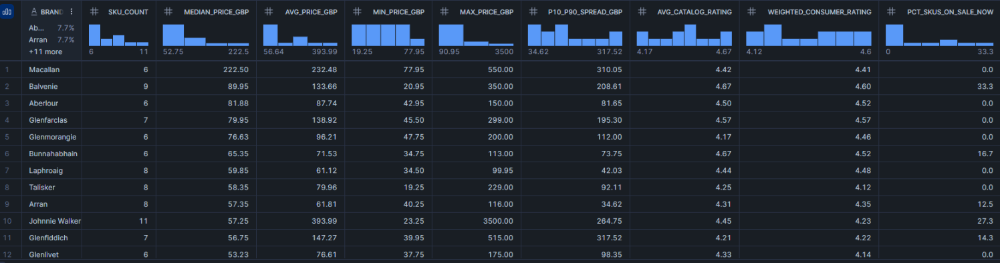

# Analytics Queries Documentation

This document describes the analytical SQL queries used in the project, outlining  
the business questions addressed, data sources, and key insights derived from each analysis.

Each query is implemented in `analytics_queries.sql` and supported by visual outputs  
stored in the `outputs/screenshots/` directory.

---

### Q1. Brand-Level Price & Quality Positioning

**Business Question**  
How do brands differ in terms of pricing, product spread, customer ratings, and current promotional activity?

**Query Reference**  
`analytics_queries.sql` → Query 1 (Brand-Level Price and Quality Positioning)

**Source View**  
`VW_PRODUCT_LATEST`

**Analytical Interpretation**  
- Premium brands tend to cluster at higher median prices while maintaining strong consumer ratings, suggesting that higher pricing does not negatively impact perceived quality.
- Brands with wider price spreads often operate across multiple product tiers, indicating diversified portfolios rather than a single price positioning.
- Weighted consumer ratings remain consistently high across most brands, implying generally strong customer satisfaction within the category.
- Discount activity varies significantly by brand, with some maintaining full-price strategies while others actively use promotions to drive volume.
- The combination of pricing, spread, and discount behavior highlights distinct brand strategies ranging from exclusivity-focused to promotion-driven positioning.

**Suggested Screenshot**  

---
