# Power BI Dashboard Analysis

## Whisky Pricing Analytics Dashboard

This Power BI dashboard provides a structured analytical assessment of whisky market dynamics, focusing on:

- Pricing strategy  
- Brand positioning  
- Value efficiency  
- Discount impact  
- Demand elasticity  

All insights are evaluated across three category views:

1. **All**
2. **Blended**
3. **Single Malt**

Each section below presents the relevant dashboard screenshots followed by structured analytical interpretation and strategic implications.

All visuals are built on the curated dataset (VW_PRODUCT_LATEST) and structured measures defined in the analytics layer.

---

# Page 1: Market Overview

---

## Business Objective

To evaluate overall market structure by analyzing price distribution, engagement concentration, rating dispersion, and tier segmentation across whisky categories.

---

## Visual Evidence

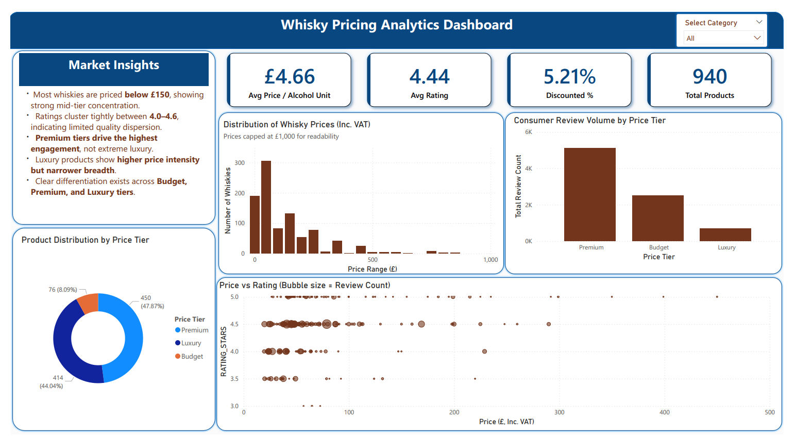

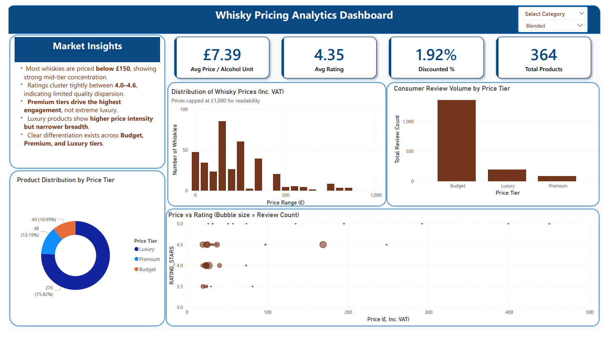

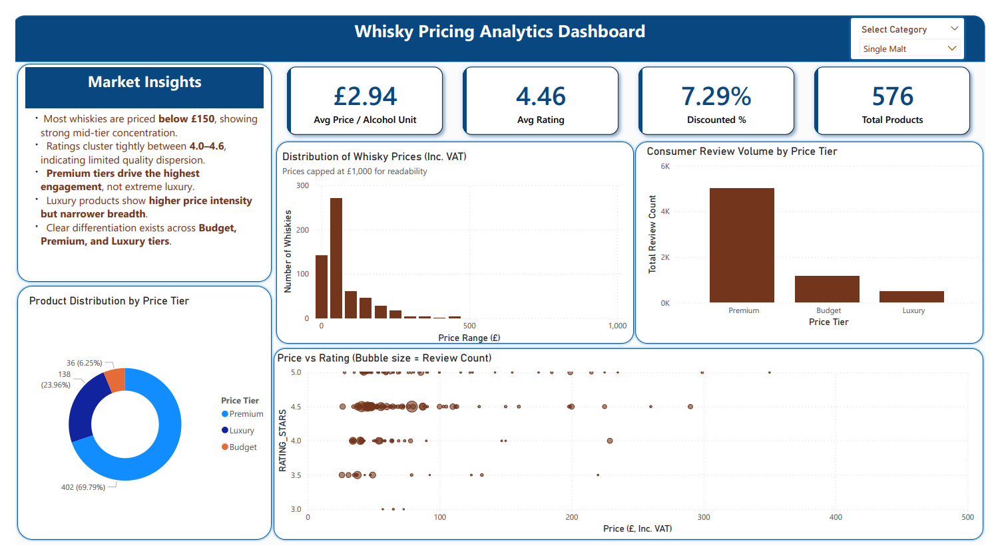

---

## Analytical Interpretation

- The price distribution is positively skewed, with the majority of products priced below £150, indicating structural mid-tier concentration.
- Average ratings remain tightly clustered (≈4.3–4.5) across all price levels, suggesting limited quality dispersion.
- Premium tier generates the highest aggregate review volume, while Luxury maintains narrower engagement relative to price intensity.
- Product supply is concentrated within the Premium segment, with Luxury representing a smaller proportion of total SKUs.
- No strong linear relationship is observed between price and rating, indicating relative rating inelasticity across tiers.

---

## Strategic Implication

- Portfolio expansion should prioritize Premium pricing bands where engagement density is highest.
- Luxury positioning requires stronger differentiation beyond price signaling.
- Competitive advantage is likely driven by breadth and brand equity rather than incremental price increases.

---

# Page 2: Brand Positioning

---

## Business Objective

To assess competitive brand positioning by analyzing price intensity, rating strength, revenue potential, and product tier distribution across whisky categories.

---

## Visual Evidence

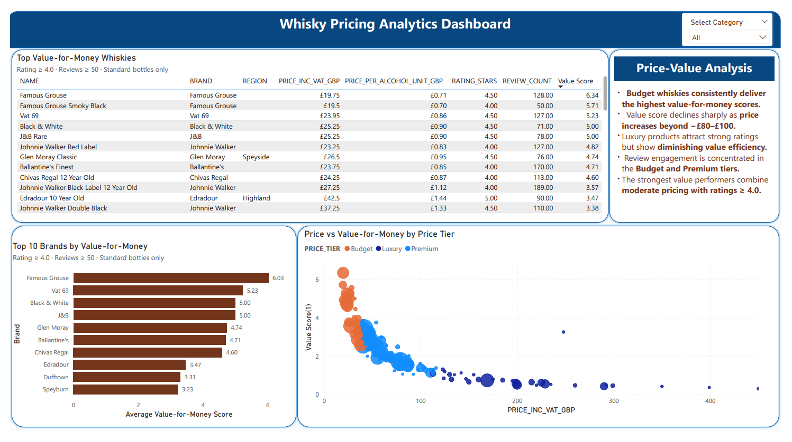

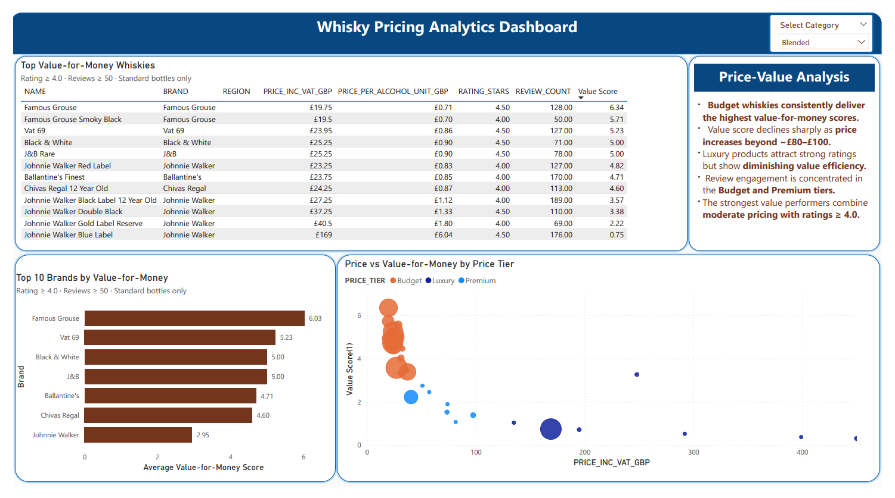

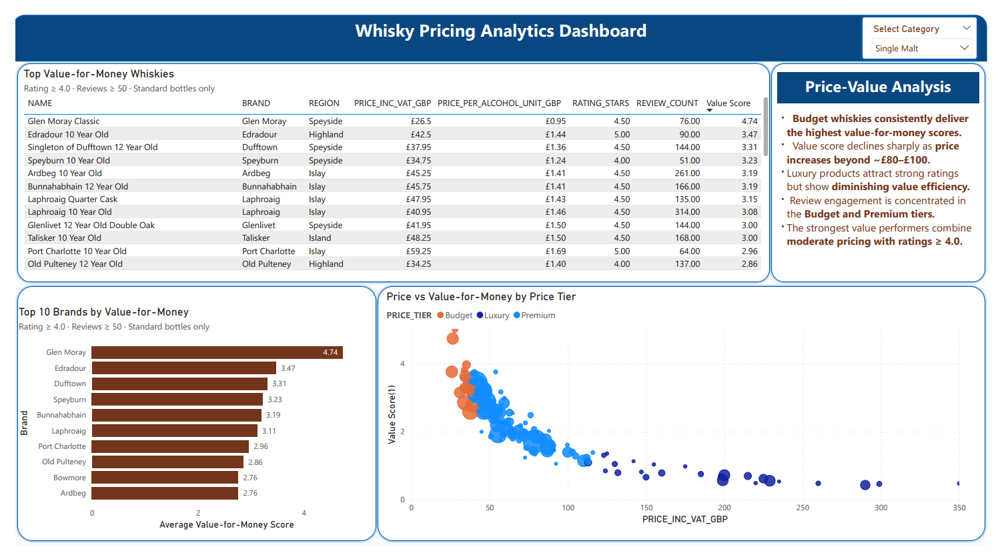

---

## Analytical Interpretation

- Brand positioning reveals clear differentiation across price tiers, with distinct clustering between Budget, Premium, and Luxury segments.
- High-revenue brands combine strong review volumes with mid-to-upper pricing rather than extreme luxury positioning.
- Premium-tier brands demonstrate higher price intensity but narrower SKU breadth compared to diversified portfolios.
- Several brands achieve strong ratings without occupying the highest price bands, indicating competitive value positioning.
- Revenue concentration is driven more by engagement scale (review count × price) than by rating superiority alone.

---

## Strategic Implication

- Revenue growth is most sustainable in the mid-to-premium segment where pricing and engagement intersect.
- Luxury brands require strong brand equity to justify elevated price positioning.
- Competitive advantage depends on balancing price intensity with portfolio breadth and review visibility.
---

# Page 3: Value Analysis

---

## Business Objective

To evaluate value efficiency across whisky products by analyzing price per alcohol unit, rating-adjusted value score, and brand-level value positioning across Budget, Premium, and Luxury tiers.

---

## Visual Evidence

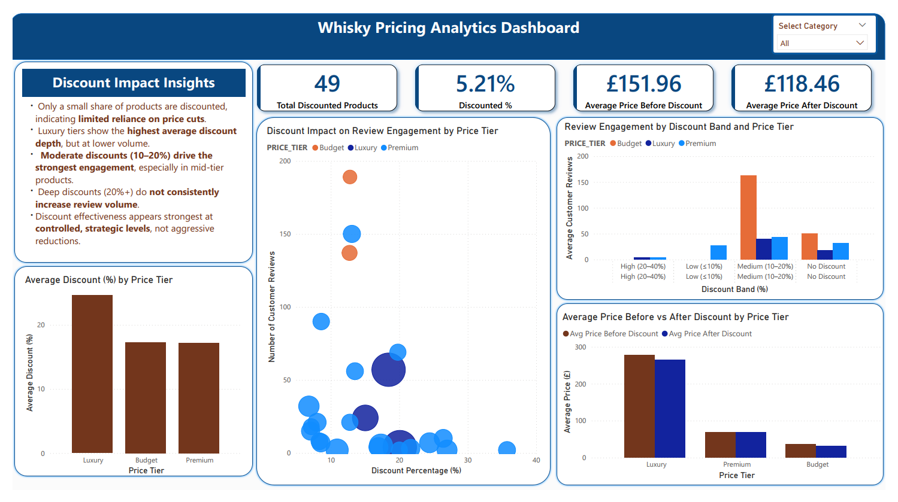

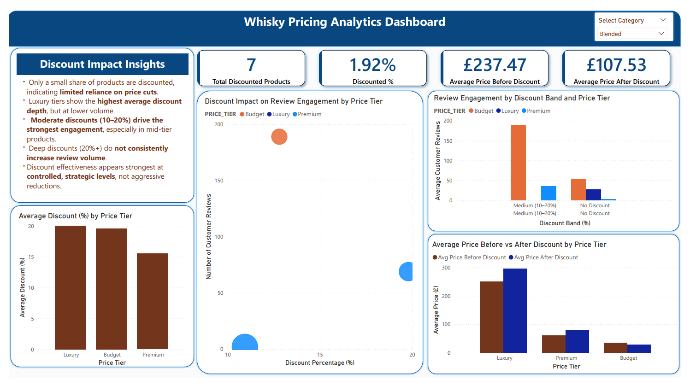

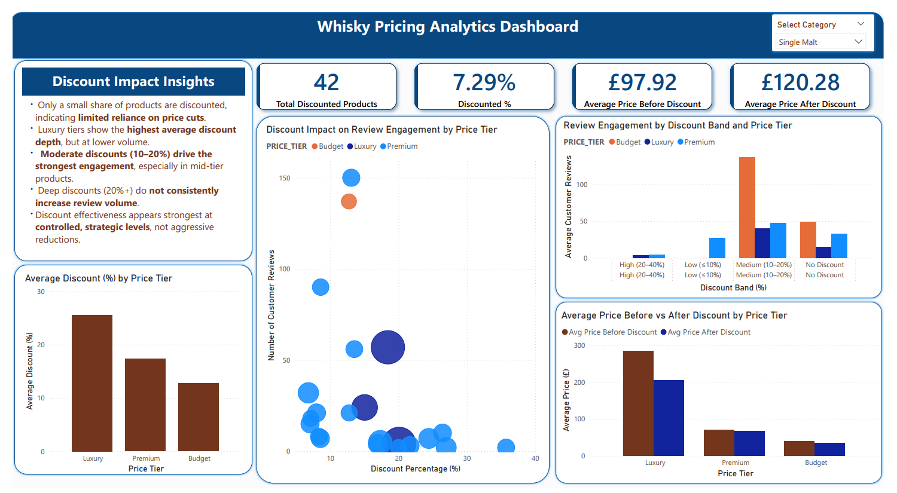

---

## Analytical Interpretation

- Value scores decline non-linearly as price increases, confirming diminishing marginal value beyond mid-tier price ranges.
- Budget whiskies consistently achieve the highest value-for-money scores, driven by strong ratings relative to low price-per-unit alcohol cost.
- Premium tier demonstrates balanced value efficiency, maintaining rating stability while offering moderate pricing.
- Luxury products retain high ratings but show significantly lower value scores due to elevated price intensity.
- Across all category views, strongest value performers combine ratings ≥ 4.0 with moderate pricing (<£80–£100 range).

---

## Strategic Implication

- Competitive positioning in the Premium segment offers the strongest balance between margin potential and perceived value.
- Budget tier remains volume-driven with high engagement leverage.
- Luxury strategy should emphasize brand equity and exclusivity rather than value signaling.
- Price increases beyond upper mid-tier levels require stronger differentiation to justify declining value efficiency.

---

# Page 4: Discount Impact

---

## Business Objective

To assess how discount depth influences review engagement, price positioning, and tier-level performance across whisky categories.

---

## Visual Evidence

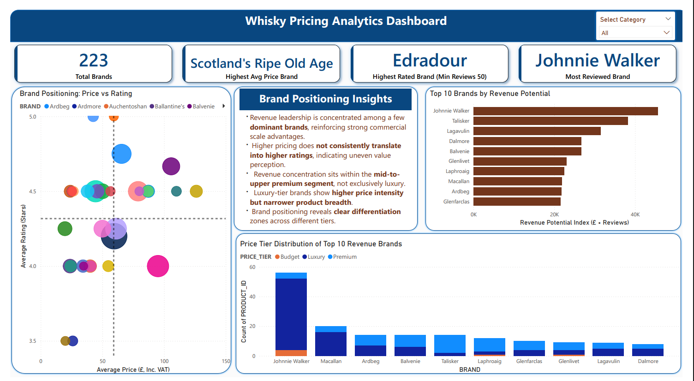

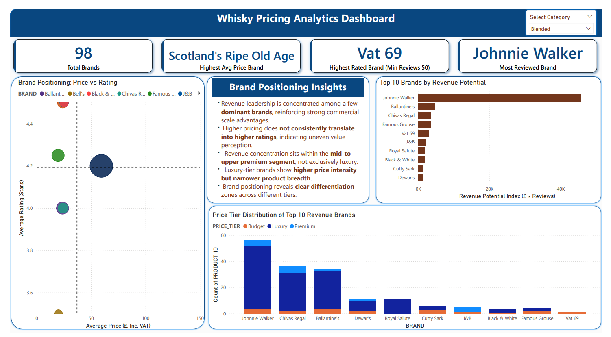

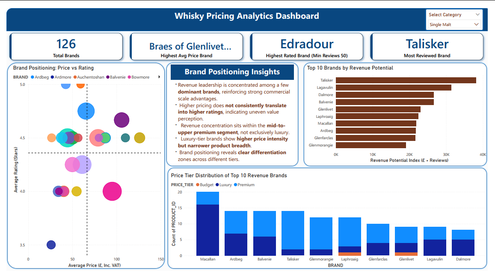

---

## Analytical Interpretation

- Discount penetration remains structurally low across the portfolio (≈2–7%), indicating limited reliance on price reductions.
- Luxury tier shows the highest average discount depth, though applied to a smaller number of SKUs.
- Moderate discounts (10–20%) generate stronger engagement than deep discounts (>20%), particularly within mid-tier products.
- Deep discounting does not consistently increase review volume, suggesting diminishing promotional returns.
- Across category views, discount effectiveness appears strongest at controlled, mid-level reductions rather than aggressive price cuts.

---

## Strategic Implication

- Discounting should be applied selectively within Premium segments to optimize engagement without eroding brand equity.
- Luxury brands should use discounts sparingly to preserve exclusivity positioning.
- Promotional strategy should prioritize moderate reductions rather than high-discount campaigns.
- Long-term growth is better driven by positioning and perceived value rather than heavy price-based competition.

---

# Page 5: Pricing Strategy

---

## Business Objective

To evaluate how pricing bands influence review engagement, product supply concentration, and demand elasticity across whisky categories.

---

## Visual Evidence

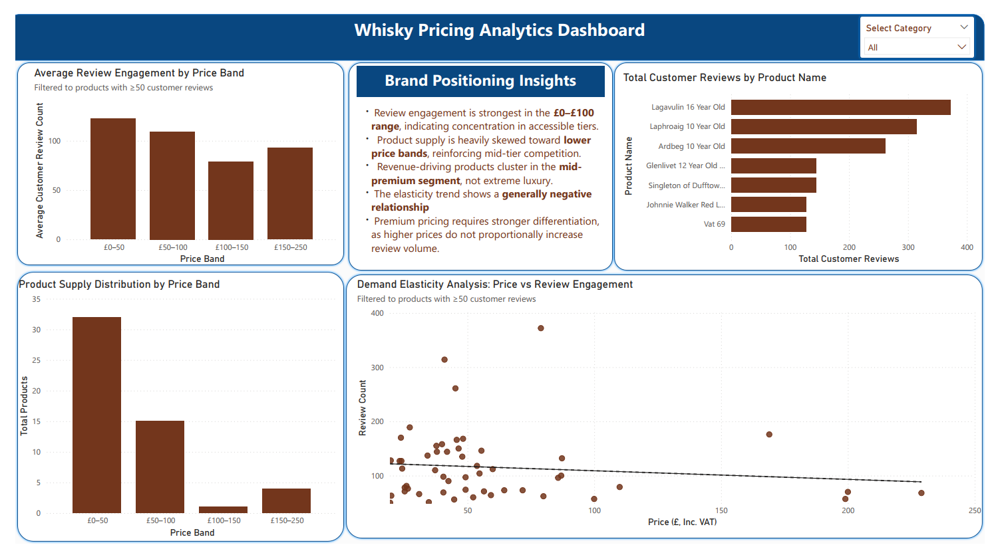

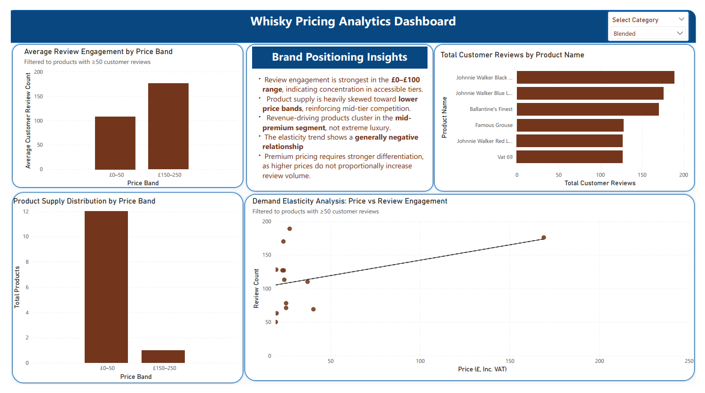

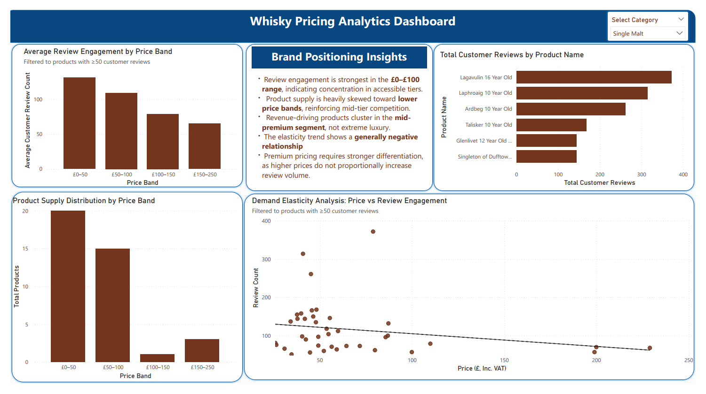

---

## Analytical Interpretation

- Review engagement is strongest within the **£0–£100** price range, indicating demand concentration in accessible tiers.
- Product supply is heavily skewed toward lower price bands, reinforcing competitive density in mid-tier segments.
- Revenue-driving products cluster within the **mid-to-upper premium segment**, not exclusively in extreme luxury.
- The elasticity trend shows a **generally negative relationship** between price and review engagement.
- Higher price points do not proportionally increase review volume, indicating limited engagement scalability at luxury levels.

---

## Strategic Implication

- Portfolio strategy should prioritize strength in the **£50–£150 range**, where engagement and supply intersect.
- Premium pricing requires clear differentiation beyond price signaling to sustain review traction.
- Luxury expansion should focus on brand equity and exclusivity rather than volume-based growth.
- Competitive positioning is strongest when balancing price accessibility with perceived quality.

---

# Overall Strategic Conclusion

- The whisky market is structurally concentrated in the mid-to-premium pricing bands, where engagement density and portfolio breadth intersect.
- Rating dispersion remains limited across tiers, indicating that higher pricing does not inherently guarantee superior perceived quality.
- Value efficiency declines as price intensity increases, reinforcing diminishing marginal returns beyond upper mid-tier levels.
- Discount effectiveness is strongest at moderate levels, with deep discounting offering limited engagement scalability.
- Revenue concentration is driven primarily by brand equity and review volume rather than extreme luxury positioning.

---

# Final Recommendation

- Prioritize expansion and optimization within the Premium segment, where pricing power and engagement balance most effectively.
- Maintain disciplined discount strategies to protect long-term brand equity.
- Use luxury positioning selectively, supported by differentiation rather than price signaling alone.
- Continue leveraging data-driven elasticity monitoring to refine pricing and promotional strategy over time.

---

