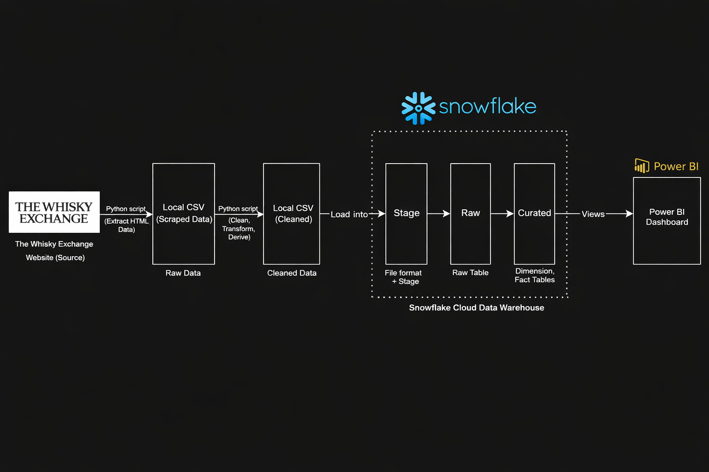
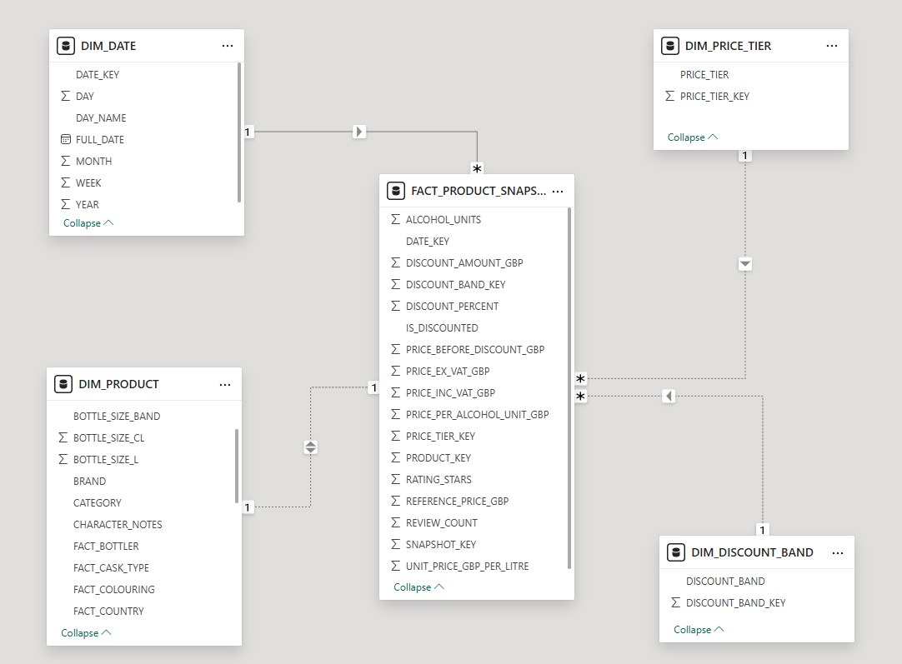

# Whisky Pricing Analytics Pipeline & Dashboard Project

This project implements an end-to-end data analytics pipeline to analyze whisky product pricing dynamics, discount behavior, customer ratings, and value efficiency. The pipeline integrates data scraping, warehouse modeling, analytical SQL, and BI visualization into a structured pricing intelligence framework.

---

## Project Purpose

The objective of this project is to simulate a real-world pricing analytics environment, demonstrating how raw scraped data can be transformed into structured warehouse models and converted into decision-oriented business insights.

The analysis focuses on:
- Whisky price distribution
- Regional price differences
- Relationship between price, ratings, and popularity
- Product segmentation by price tier
- Discount and value-for-money analysis

---
## Tech Stack

- Data Collection: Python (web scraping)
- Data Processing: Python
- Data Warehouse: Snowflake
- Data Modeling: Star schema (DIM_* + snapshot fact table)
- Analytics Layer: Snowflake Views
- Visualization: Power BI
- Version Control: Git & GitHub

---

## Repository Structure

```text
ECOMMERCE-PRICING-ANALYTICS-PIPELINE/
│
├── data/                        # Raw and intermediate datasets
├── docs/                        # Project documentation
├── notebooks/                   # Exploratory analysis & experimentation
│
├── outputs/
│   ├── figures/                 # Architecture & star schema diagrams
│   ├── screenshots/
│   │   └── powerbi_dashboard/   # Dashboard page screenshots
│   └── tables/                  # Exported summary tables
│
├── powerbi/
│   └── whisky_dashboard.pbix    # Final Power BI dashboard file
│
├── sql/
│   ├── 01_setup/                # Database & schema setup
│   ├── 02_stage/                # Stage layer
│   ├── 03_raw/                  # RAW landing tables
│   ├── 04_curated/              # Star schema (DIM_* + FACT_PRODUCT_SNAPSHOT)
│   └── 05_analytics/            # Analytical views (VW_PRODUCT_LATEST)
│
├── src/
│   ├── scraping/                # Web scraping logic
│   ├── cleaning/                # Data transformation & enrichment
│   ├── utils/                   # Helper functions
│   └── __init__.py
│
├── ANALYTICS_QUERIES.md         # SQL queries + derived insights
├── POWERBI_VISUALS_ANALYSIS.md  # Dashboard page-by-page documentation
├── requirements.txt             # Python dependencies
└── README.md                    # Project overview
```

---

## Architecture Overview

**Pipeline Flow**



**Diagram Explanation**

The pipeline begins by scraping whisky product data from The Whisky Exchange website using Python. The scraped data is first saved as a raw CSV, then cleaned and enriched in Python to derive pricing, alcohol, discount, and categorization metrics. The cleaned CSV is loaded into Snowflake using a Stage and `COPY INTO`, landing in the RAW schema. From there, the data is transformed into a curated star schema where **DIM_\*** tables store descriptive product, date, price tier, and discount attributes, while **FACT_PRODUCT_SNAPSHOT** captures time-varying pricing, discount, and rating metrics per product per scrape date. Finally, analytical views are created in Snowflake and consumed by Power BI to power interactive dashboards.

---

## End-to-End Workflow

1. Scrape product-level whisky data (price, rating, alcohol, discount, region).
2. Clean and engineer derived metrics in Python (price per alcohol unit, discount band, value score).
3. Load data into Snowflake RAW schema.
4. Transform into curated star schema (dimensions + snapshot fact table).
5. Build analytical views to answer business questions.
6. Connect Power BI to curated views for dashboard visualization.

---

## Data Model Overview

The curated data warehouse follows a star schema design. Dimension tables store descriptive attributes such as product details, regions, and categorization, while a snapshot-based fact table records time-varying pricing, discount, and rating metrics to support analytical queries and time-based analysis.



---

## Data Engineering Concepts Applied

- Snapshot fact modeling for time-variant pricing analysis  
- Star schema dimensional modeling  
- Discount band and price tier categorization  
- Derived metrics (Value Score, Revenue Index, Price per Alcohol Unit)  
- Layered architecture: RAW → CURATED → ANALYTICS  

---

## Business Questions Addressed

This project investigates strategic pricing and value dynamics within the whisky market, addressing questions such as:

- How do brands justify premium pricing through ratings, age, strength, and reputation?
- Which regions sustain higher price intensity without sacrificing customer satisfaction?
- Where does value-for-money peak across Budget, Premium, and Luxury tiers?
- How effective are current discount strategies in driving review engagement?
- At what age bands do diminishing returns begin to emerge in whisky pricing?
- Which price ranges generate the highest review engagement and revenue potential?

---

## Key Analytical Findings

- Premium pricing is driven primarily by age tier, cask strength, and brand equity rather than ratings alone.
- Mid-tier pricing bands (£50–£150) show the strongest intersection of engagement density and revenue scalability.
- Budget blended whiskies dominate value-for-money rankings due to efficient pricing and strong review support.
- Discounting is applied selectively, with moderate (10–20%) reductions generating stronger engagement than deep cuts.
- Aging beyond the mid-teens (≈18 years) demonstrates diminishing marginal value relative to price increases.
- Luxury positioning relies more on scarcity and prestige signaling than on incremental quality improvements.

---

## Strategic Implications

- Competitive advantage is strongest in the mid-to-premium segment where pricing power and engagement align.
- Luxury expansion should emphasize brand differentiation and scarcity rather than aggressive pricing.
- Discount strategies should prioritize controlled, moderate reductions to protect brand equity.
- Pricing strategy should be continuously monitored using elasticity indicators to optimize revenue efficiency.

---
